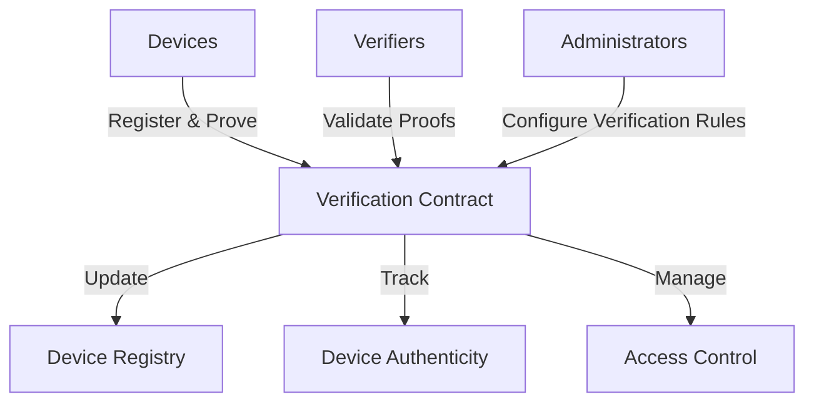

# Proven Bitcoin Device Verification

A blockchain-based platform for secure Bitcoin device authentication and verification using cryptographic proofs.

## Overview

Proven Bitcoin Device enables secure device registration, tracking, and validation on the blockchain. The platform features:

- Cryptographically secure device registration
- Trusted device verification mechanisms
- Decentralized device authentication
- Role-based access control
- Transparent device provenance tracking
- Secure key management and verification

## Architecture

The Proven Bitcoin Device system is built around a core smart contract that handles:



### Core Components:
- Device Registration
- Cryptographic Proof Verification
- Authentication Tracking
- Access Control Management
- Device Provenance Tracking

## Contract Documentation

### Bitcoin Device Verifier Contract (`bitcoin-device-verifier.clar`)

The main contract managing the entire device verification ecosystem.

#### Key Features:
- Role-based access control
- Secure device registration
- Cryptographic proof validation
- Device status tracking
- Permissioned device management

#### Access Control
- Contract Owner: Full administrative control
- Verifiers: Authorized to validate device proofs
- Administrators: Configure verification rules
- Devices: Register and manage their cryptographic credentials

## Getting Started

### Prerequisites
- Clarinet
- Stacks wallet
- STX tokens for registration

### Basic Usage

1. **Registering a Device**
```clarity
(contract-call? .bitcoin-device-verifier register-device
    "device-unique-id"
    "public-key-hex"
    "initial-proof-signature")
```

2. **Validating a Device**
```clarity
(contract-call? .bitcoin-device-verifier validate-device
    "device-unique-id"
    "validation-proof")
```

3. **Checking Device Status**
```clarity
(contract-call? .bitcoin-device-verifier get-device-status
    "device-unique-id")
```

## Function Reference

### Administrative Functions
- `set-contract-owner`: Update contract owner
- `grant-verification-role`: Assign verification permissions
- `revoke-verification-role`: Remove verification permissions

### Device Management
- `register-device`: Add new device to registry
- `update-device-status`: Modify device authentication status
- `revoke-device`: Invalidate a device's credentials

### Verification Functions
- `validate-device-proof`: Verify cryptographic device proof
- `check-device-authenticity`: Determine device trustworthiness

### Read-Only Functions
- `get-device-details`: Retrieve device registration information
- `get-device-status`: Check current device authentication status
- `list-verified-devices`: Retrieve all verified devices

## Development

### Testing
```bash
# Run contract tests
clarinet test

# Check contract deployment
clarinet console
```

### Local Development
1. Clone the repository
2. Install Clarinet
3. Deploy contracts locally:
```bash
clarinet deploy --local
```

## Security Considerations

### Key Security Features
- Cryptographic proof validation
- Strict role-based access control
- Immutable device registration records
- Permissioned device management

### Best Practices
- Use strong, unique cryptographic proofs
- Regularly rotate device credentials
- Implement multi-factor device authentication
- Monitor and audit device registration events

### Risk Mitigation
- Validate all cryptographic proofs
- Implement time-based credential expiration
- Support emergency device revocation
- Maintain detailed device audit logs